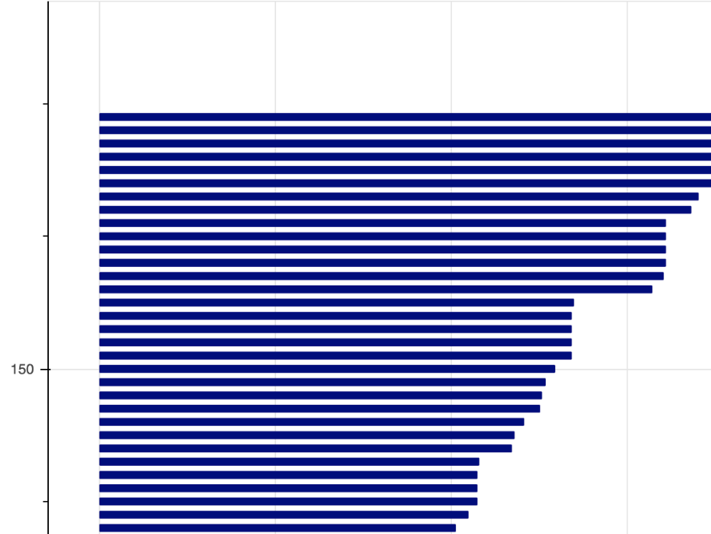
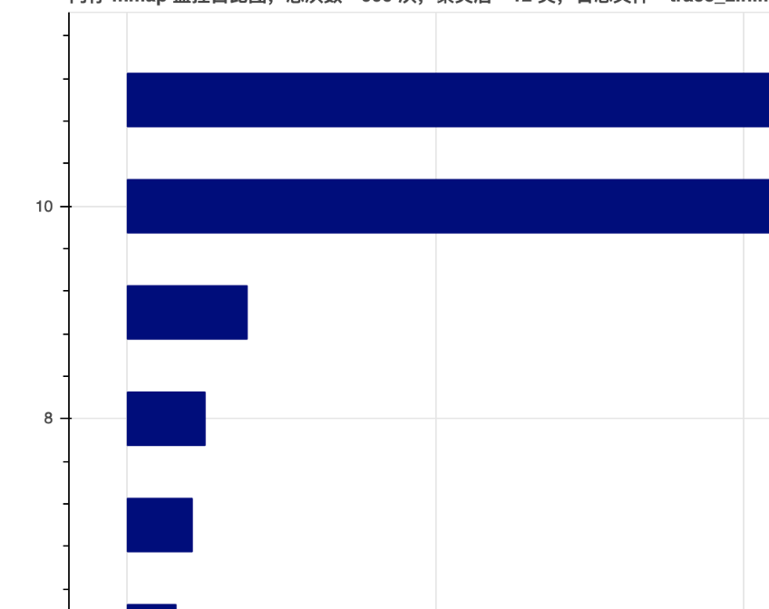

### 简介
HiMem 是针对 Android 系统的内存使用监控与分析套件，目前支持 mmap/munmap/malloc/calloc/realloc/free 等库函数的监控，当发生内存分配的调用时 SDK 会收集函数参数以及 Java 层和 Native 层调用栈。
### 集成方式
#### 常规集成
HiMem 主要包含下列部分：
* HiMem/ 目录下是需要集成到 APK 中的 SDK；
* HiMemAnalyzer/ 目录下是日志分析工具，用于一键生成分析报告；
* app/ 是 Demo 应用；
可以直接通过源码集成到 APK：
``` gradle
implementation project(":HiMem")
```
或者通过 mavenLocal 的方式集成：
``` gradle
implementation "zhihu.himem:himem:1.0.0"
```
SDK 对外接口类是 HiMemNative，初始化方法是 initAndStart()，注释如下：
``` kotlin
/**
 * 初始化 himem，包括创建 .himem 日志文件，初始化信号处理、xhook等
 *
 * @param dumpDir .himem 文件的父目录
 * @param mmapSizeThreshold mmap 阈值，超过阈值时触发监控逻辑
 * @param flushThreshold 日志回写磁盘的阈值，超过阈值 fflush
 */
fun initAndStart(dumpDir: String, mmapSizeThreshold: Long, flushThreshold: Long)
```
通常初始化代码如下：
``` kotlin
class MyApplication : Application() {

    override fun onCreate() {
        super.onCreate()
        
        // 只监控主进程
        if (!isMainProcess())
            return;
                
        // 创建存放日志的目录
        val root = File(externalCacheDir!!.absolutePath, "HiMem/")
        root.mkdirs()
        // 当 mmap 超过 1MB 时触发监控逻辑
        val mmapSize = 1 * 1024 * 1024
        val flushSize = 8 * 1024
        // 启动 HiMem
        HiMemNative.initAndStart(root.absolutePath, mmapSize, flushSize)
    }
}
```
启动后 HiMem 会在你指定的日志目录下创建 trace_timestamp.himem 日志文件。
#### 高级接口
重点说下 HiMemNative.refreshHook() 方法，注释如下：
``` kotlin
/**
 * 采用 dl_iterate_phdr() 回调的方式触发新 so 的 hook（有些 so 是运行时加载的）
 */
fun refreshHook()
```
如果应用中有运行时加载 so 库的情况，并且有监控需求，需要在 System.load() 之后重新 hook 也就是调下 refreshHook()（也可以定时调用）。
但经过知乎线上数据看这个接口会造成崩溃率上升，所以请酌情使用。
### 分析方式
#### 生成报告
拿到日志文件后，可以通过 HiMemAnalyzer 目录下提供的工具创建分析报告，首先安装依赖：
``` bash
zkw@zkw-mint$: pip3 install bokeh
```
执行命令：
``` bash
zkw@zkw-mint$: python3 ./HiMemAnalyzer/himem.py trace_1609069768.himem
开始解析...
原始数据解析完毕，总共 10194 条

聚合完毕，生成图表...
[removeForMunmaped] 未找到相同地址的 mmap 事件，address:838fa000
[removeForMunmaped] 未找到相同地址的 mmap 事件，address:802ad000
解析完成！
```
解析完成会在同级目录下创建 trace_1609069768.himem.html 报告文件，并自动打开浏览器。

报告分三部分：内存分配趋势图；内存分配排名（精确聚类）；内存分配排名（粗略聚类）。
分别如下所示：

<p>
<table cellspacing="10">
<tr>

  <td>
  <a href="https://zkwlx.github.io/HiMem/doc/trace_2.himem.html">
  
    <p/>内存分配趋势图 点击体验
  </a>

  </td>

  <td>
  <a href="https://zkwlx.github.io/HiMem/doc/trace_2.himem.html">
  
    <p/>内存分配排名（精确聚类） 点击体验
  </a>
  </td>

  <td>
  <a href="https://zkwlx.github.io/HiMem/doc/trace_2.himem.html">
  
    <p/>内存分配排名（粗略聚类） 点击体验
  </a>
  </td>

</tr>
</table>
</p>

* 内存分配趋势图：表示运行期间 App 所发生的 mmap/munmap 或 malloc/free 的总体趋势，X 轴可以认为是时序
* 内存分配排名：表示聚类后的内存分配从大到小排名，具体聚类算法如下
    * 精确聚类：mmap 的 length、protect、flag 参数以及调用栈 stack 完全相同
    * 粗略聚类：mmap 的 protect、flag 参数以及调用栈 stack 的第一行相同

每个图表鼠标悬停时都会有详细信息，如下图：


### 原理

### 鸣谢
[https://github.com/iqiyi/xHook](https://github.com/iqiyi/xHook)

[https://github.com/facebookincubator/profilo](https://github.com/facebookincubator/profilo)

# License
```
Copyright 2019 Square, Inc.

Licensed under the Apache License, Version 2.0 (the "License");
you may not use this file except in compliance with the License.
You may obtain a copy of the License at

   http://www.apache.org/licenses/LICENSE-2.0

Unless required by applicable law or agreed to in writing, software
distributed under the License is distributed on an "AS IS" BASIS,
WITHOUT WARRANTIES OR CONDITIONS OF ANY KIND, either express or implied.
See the License for the specific language governing permissions and
limitations under the License.
```
